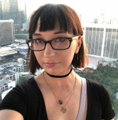

# Nery Chapeton-Lamas
## Contact Info:  [Email](nchapetonLamas@miracosta.edu)  [LinkedIn](https://www.linkedin.com/in/nerychapeton/)

## Education

 - **University of Iowa**
M.C.S., Computer Science - May 2012
*Emphasis: Human Computer Interaction*
- **University of California, Irvine**
B.S., Computer Science & Engineering - June 2010
*Specialization: Embedded Systems*

## Skills
- **Primary Languages**: Java, Objective-C, Bash
- **Secondary Languages**: Python, C/C++, PHP, MySQL, HTML, JavaScript, CSS, XML, Android 4.0
- **Operating Systems**: Mac OS X, Linux (Ubuntu, Arch Linux), Windows
- **Foreign Languages**:  Fluent native Spanish speaker/writer

## Teaching Experience
- **Tenure-Track Full-Time Faculty – Computer Science**
	- *MiraCosta College (Fall 2012 - Present)*
	- Currently teaching: *CS 111 Introduction to Computer Science I: Java*, course introduces computer science and an object-oriented programming language and develops basic programming skills. *CS 220 Computer Architecture*, integrating key notions from algorithms, computer architecture, operating systems, compilers, and software engineering in one unified framework to build a computer from scratch (in a simulator) using the NAND2Tetris curriculum. *CS113 Data Structures and Algorithms*, course introduces data structures (linked lists, queues, stacks, trees, graphs) through project-based learning to practice software development methodologies like Agile/Scrum.
- **Adjunct Professor – Computer Science**
	- *Saddelback College (Fall 2012 - Summer 2014)*
	- Taught CS 1A Introduction to Computer Science, course begins with a broad overview of the field, covering topics like: history, simple arithmetic, hardware, software, and problem solving.  Introduces C++ programming while providing a solid foundation in creating well-documented, manageable code.  Also co-taught CS 1B (Intermediate C++), CS 1C (Advanced C++) and CS 1D (Data Structures) further exploring C++ and Object Oriented Programming.
- **Adjunct Professor – Computer Science**
	- *Santa Monica College	(Spring 2013)*
	- Taught CS 55 Java Programming, intended for students who completed a course in C programming. Topics covered included the Java programming language, object-oriented programming (OOP), the Java applications programming interface (API), computer graphics programming, and graphical user interfaces (GUI’s).

## Research Experience
- **Mars Lava Formation Identification App**
	- *Jet Propulsion Lab, Pasadena, CA (Summer 2013)*
	- Developed a crowdsourcing prototype iPad application to gather Mars Lava Formation data for scientists at JPL. Aimed at middle school students or higher, it would teach students how to identify interesting formations and provide useful data to JPL. A student of mine from SMC (Santa Monica College) analyzed the crowdsourced data, through several data mining algorithms, to arrive at the best possible guess in identifying the formation.
- **Survey of Pointing Task Studies: How Are Motor Impaired Users Assisted?**
	- *University of Iowa (Fall 2011)*
	- Survey paper providing an overview of the techniques/algorithms that have been proposed and tested in the field of aiding a user with pointing tasks, such as adaptive CD-ratio and area cursor techniques.  Specifically measures their usability and feasibility for users with motor impairments.
- **Helping a User Make Secure Choices – Case Study**
	- *University of Iowa (Spring 2011)*
	- Designed and performed user case studies to help users make secure choices in a more intuitive way by comparing a Linksys Router setup wizard against a custom setup wizard that was created for the study. Simulations created using HTML, JavaScript, PHP with a MySQL backend to log user choices for analysis.

## Work Experience
- **[Draftpedia iPhone App](https://www.forbes.com/sites/darrenheitner/2013/04/23/nfl-draft-data-conveniently-consolidated-by-new-mobile-app-draftpedia/#601c6f8030e0) - *Santa Monica, CA***
	- *Freelance iOS Developer (February - April 2013)*
	- Converted a PhoneGap app into a native iPhone app using a local SQLite database to store all NBA/NFL Draft information for the last 40+ years.  Added Twitter integration, user analytics using TestFlight, Retina display support, and both iPhone dimension support for iOS 5.1+
- **Rapid Consulting Services, Inc. - *Irvine, CA***
	- *Senior iOS Developer (September 2012 - April 2013)*
	- iOS team leader managing multiple developers and projects to ensure adequate work dispersal as well as accomplishing deadlines on time.  Facilitate communication between design team and development team to streamline software development lifecycle.  Developed iOS applications for clients using various backends (Sybase Unwired Platform, SQL, etc.) to create a mobile solution for their business.

## Honors and Awards
- Graduate Student Leadership Award, Center for Student Involvement & Leadership, University of Iowa, 2012
- Hispanic Scholarship Fund – Mazda Scholarship Recipient, Fall 2008
- Dean’s Honor List, UCI, Fall 2005, Winter 2006
